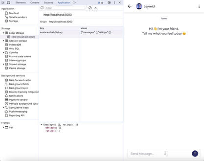

# Chatbot Application Documentation

## Table of Contents

- [Chatbot Application Documentation](#chatbot-application-documentation)
- [Table of Contents](#table-of-contents)
- [Introduction](#introduction)
- [TechStack](#techstack)
- [Installation \& Running](#installation--running)
- [Environtment Variables](#environtment-variables)
- [Folder Structure](#folder-structure)
- [Routing](#routing)
- [API Routes](#api-routes)

---

## Introduction

Chatbot NextJS Application is a web app build with NextJS 14 and openAI to develop single chat bot room so user can do a conversation with bot. This app designed with a friendly and funny AI like a human with **gpt-3.5-turbo** model. User can reload the page without loosing recent conversation and also can give rate to every AI's message.



## TechStack

This app developed with NextJS version 14 and Typescript. The main thing we need to enable chat with bot is OpenAI and Vercel AI SDK.

- **Framework**: Next.js 14.1.1, React (^18)
- **Language**: TypeScript ^5
- **Styling**: CSS Modules, Tailwind CSS (^3.4.3), DaisyUI (^3.1.6)
- **Database**: no database (store on local storage)
- **APIs**: OpenAI ^4.32.2
- **Formatter**: ESLint (^8)
- **Other**: AI (^3.0.18)

---

## Installation & Running

```bash
# Install Node.js and npm
# Clone the repository
git clone https://github.com/syaina/chatbot-next-app
cd chatbot-next-app

# Install dependencies
# Please use node version >= 18
yarn install
yarn dev

# App will start with development mode on http://localhost:3000
```

---

## Environtment Variables

This app only need one variables to enable accessing OpenAI API. Please copy this variable with .env or .env.local.

```bash
OPENAI_API_KEY=[YOUR OPENAI API KEY]
```

---

## Folder Structure

```
/project-root
  /app
    /api
      /chat                       # api for chat with openAI
    /components
      /BubbleChat                 # bubble chat message component
      /ChatContainer              # container for conversation area
      /Icons                      # contains of icons
      /Modal                      # contains of modals
        /AlreadyRating
        /DeleteChat
        /Rating
      /Navbar                     # navbar for layout component
    /helpers                      # contains of functions helper
    globals.css
    layout.tsx
    page.module.css
    page.tsx
  /public
  ...

```

---

## Routing

Please access the page with '/' for index.tsx or page.tsx

```bash
/page.tsx                     # only have one page
```

---

## API Routes

Accessing API to send messages between user and assistant (bot) we need to import OpenAI chat completion API.

```ts
// app/api/chat/route.tsx

export async function POST(req: Request) {
  try {
    const body = await req.json();
    const messages = body.messages;

    const systemMessage: ChatCompletionMessageParam = {
      role: "system",
      content:
        "You are a friendy and a funny bot but act as a human friend. Please answer in that way but make it simple",
    };

    // Ask OpenAI for a streaming chat completion given the prompt
    const response = await openai.chat.completions.create({
      model: "gpt-3.5-turbo",
      stream: true,
      temperature: 1,
      messages: [systemMessage, ...messages],
    });

    // Convert the response into a friendly text-stream
    const stream = OpenAIStream(response);
    // Respond with the stream
    return new StreamingTextResponse(stream);
  } catch (error) {
    return Response.json({ error: "Internal error server" }, { status: 500 });
  }
}
```

---
